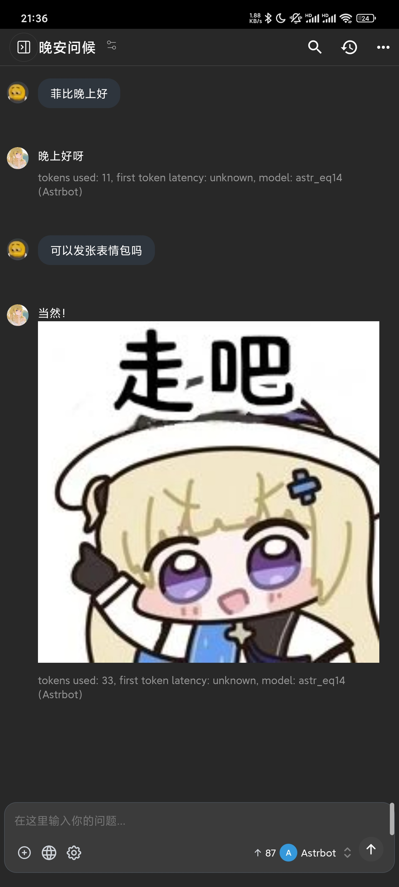

# AstrBot Chatbox 适配器 (astrbot_plugin_chatbox_adapter)

[](https://github.com/timetetng/astrbot_plugin_chatbox_adapter)

这是一个为 [AstrBot](https://docs.astrbot.app/) 提供的平台适配器插件 (v2.0)

## **注意！！！：从v1.0更新到v2.0必须要删除旧的消息平台，完全重启 Astrbot 后重新添加,否则可能会出现bug!**

它的核心功能是在本地启动一个 Web 服务器，该服务器兼容 **OpenAI API** 标准。这使得您可以将 [Chatbox](https://chatboxai.app/) 或任何其他支持 OpenAI API 格式的客户端（例如 ChatGPT-Next-Web, Open WebUI, CherryStudio 等）连接到 AstrBot。

简而言之，您可以**在 Chatbox 客户端里，与您的 AstrBot 机器人进行对话**，并使用 AstrBot 强大的 Agentic 能力和插件生态。

这对像手机端 Chatbox 等不支持 MCP 和各种插件功能的 Agent 客户端非常有价值，本适配器支持伪造其他平台的 user_id 等身份，可以实现一些多端数据共享（如果你的插件支持识别 user_id 并以此共享数据的话）。

<p align="center">
  
  &nbsp; &nbsp; 
</p>
<p align="center">
  <em>(示例：左侧为多段消息聚合，右侧为 LLM 对话，均支持图片消息v2.0)</em>
</p>

---

## 什么是 AstrBot？

AstrBot 致力于成为一个开源的一站式 Agentic 聊天机器人平台及开发框架。通过它，你能够在多种消息平台上部署和开发一个支持大语言模型（LLM）的聊天机器人。

* **大模型对话**。支持接入多种大模型服务。支持多模态、工具调用、MCP、原生知识库、人设等功能。
* **多消息平台支持**。支持接入 QQ、企业微信、微信公众号、飞书、Telegram、钉钉、Discord、KOOK 等平台。支持速率限制、白名单、百度内容审核。
* **Agent**。完善适配的 Agentic 能力。支持多轮工具调用、内置沙盒代码执行器、网页搜索等功能。
* **插件扩展**。深度优化的插件机制，支持开发插件扩展功能，社区插件生态丰富。
* **WebUI**。可视化配置和管理机器人，功能齐全。

## 什么是 Chatbox？

Chatbox AI 是一款 AI 客户端应用和智能助手，支持众多先进的 AI 模型和 API, 可在 Windows、MacOS、Android、iOS、Linux 和网页版上使用。

---

## ✨ 功能特性 (v2.0)

* **模拟 OpenAI API**：提供 `/v1/models` 和 `/v1/chat/completions` 接口，兼容 Chatbox 等客户端。
* **双向消息转换**：将 Chatbox 的 API 请求转换为 AstrBot 消息事件。
* **多消息聚合 (v2.0)**：完美解决 AstrBot 中插件分多条（如 文本+图片）发送消息时，Chatbox 客户端只能收到第一条的问题。
* **MinIO 图片上传 (v2.0)**：支持配置 MinIO/S3 对象存储，自动将机器人发送的本地图片（`file:///`）上传并转为 URL，解决 Chatbox 无法显示本地图片的问题。
* **支持流式响应**：完全支持 Chatbox 的流式打字机效果。
* **支持工具调用 (Tool Calls)**：当 AstrBot 中的大模型（如 Kimi, GLM4）决定使用工具时，适配器能正确地将其转换为 OpenAI 格式的 `tool_calls` 响应。
* **身份模拟 (Spoofing)**：允许配置适配器，使其模拟成另一个平台（如 `aiocqhttp`）的机器人，以便触发那些为特定平台编写的插件。
* **安全验证**：支持配置 `api_key` 进行 Bearer Token 验证。

## 🚀 安装

1.  **安装插件**：
    * 将本项目克隆或下载到 AstrBot 的 `data/plugins` 目录下。
    ```bash
    git clone --depth 1 https://github.com/timetetng/astrbot_plugin_chatbox_adapter.git
    ```
2.  **安装依赖**：
    * 本插件依赖 `aiohttp` 和 `minio` (v2.0 新增)。通常 AstrBot 会自动检测并提示安装。
    * 如果未自动安装，请在 AstrBot 的环境中手动运行：
    以 `uv` 为例，在插件目录下:
    ```bash
    uv add aiohttp minio
    ```
    或者在虚拟环境中使用 `pip` :

    ```bash
    pip install aiohttp minio
    ```

3.  **重启 AstrBot**。

## ⚙️ 配置

插件首次加载后，请在 AstrBot 的 `config/platform_config.py` 文件中添加 `chatbox` 平台的配置。

如果您使用 WebUI，请在“平台管理”中新建一个 `chatbox` 适配器实例。

以下是配置项说明：

```python
# config/platform_config.py
PLATFORM_CONFIG = {
    "chatbox": [
        {
            "id": "my_chatbox_server", # 实例 ID，保持唯一
            "enable": True,
            "config": {
                "api_key": "your_secret_key", # 客户端连接时使用的 API Key，留空则不验证
                "port": 8080,               # 监听端口
                "host": "127.0.0.1",        # 监听主机
                
                # --- v2.0 超时配置 ---
                "timeout": 300,             # (LLM总超时) 等待LLM生成第一条回复的总超时
                "aggregation_timeout_seconds": 2, # (消息聚合超时) 收到消息后，等待下一条消息的间隔时间
                
                # --- 默认用户信息 (可选) ---
                "default_user_id": "chatbox_api_user",
                "default_nickname": "Chatbox User",
                
                # --- 平台身份模拟 (可选) ---
                "spoof_platform": "",       # 要模拟的平台 ID, 例如 "aiocqhttp"
                "spoof_self_id": "",        # 要模拟的机器人 Bot ID (例如 QQ 号)
                "spoof_user_id": "",        # 要模拟的发送者 ID (例如 QQ 号)
                "spoof_nickname": "",       # 要模拟的发送者昵称

                # --- v2.0: MinIO S3 兼容的对象存储配置 (可选, 用于发送本地图片) ---
                "minio_enable": False, # 设为 True 以启用本地图片上传
                "minio_endpoint": "127.0.0.1:9000", # MinIO 服务器地址
                "minio_access_key": "minioadmin",   # Access Key
                "minio_secret_key": "minio123456",   # Secret Key
                "minio_bucket": "images",         # 存储桶
                "minio_secure": False,            # 是否使用 HTTPS
                "minio_use_presigned_url": False, # False: 公开URL; True: 预签名URL
                "minio_expires_duration_hours": 24, # 预签名 URL 有效期 (小时)
            }
        }
    ]
}
```

-----

## 附录：部署 MinIO 服务器 (可选)

`minio_enable` 功能依赖一个 MinIO 或 S3 兼容的对象存储服务。如果你没有，以下是使用 Docker 快速在本地（例如 `192.168.0.147`）部署一个 MinIO 服务的教程。

### 1\. 创建 `docker-compose.yml`

在你的服务器上创建一个 `minio` 目录，然后在里面创建 `docker-compose.yml` 文件。

```bash
mkdir minio
cd minio
touch docker-compose.yml
```

粘贴以下全部内容到 `docker-compose.yml`：

```yaml
services:
  minio:
    # 1. 使用官方镜像
    image: minio/minio:latest
    container_name: minio-server
    
    ports:
      # 2. 映射端口
      # 9000 是 S3 API 端口 (给插件配置用)
      # 9001 是 Web 管理界面端口 (给你用)
      - "9000:9000"
      - "9001:9001"
      
    volumes:
      # 3. 挂载数据卷，所有图片都会存在这里
      - ./data:/data
      
    environment:
      # 4. 设置你的管理员账户和密码（改成你自己的）
      - MINIO_ROOT_USER=minioadmin
      - MINIO_ROOT_PASSWORD=minio123456
      
    # 5. 启动命令：启动服务器并指定Web管理界面在 9001 端口
    command: server /data --console-address ":9001"
    
    restart: unless-stopped

networks:
  default:
    name: minio-network
```

### 2\. 启动服务

```bash
docker-compose up -d
```

### 3\. 配置 MinIO (只需一次)

#### 访问 Web 界面

打开浏览器，访问 `http://192.168.0.147:9001` (注意是 `9001` 端口，并将 IP 换成你服务器的实际 IP)。

#### 登录

使用你在 `docker-compose.yml` 中设置的 `MINIO_ROOT_USER` (minioadmin) 和 `MINIO_ROOT_PASSWORD` (minio123456) 登录。

#### 创建 Bucket (存储桶)

登录后，点击 "Create Bucket"。

  * **Bucket 名称**：`images` (或者你在插件配置中填写的 `minio_bucket` 名称)

### 4\. 设置 Bucket 为公开 (关键)

为了让 Chatbox 能访问图片 URL，你需要将这个 Bucket 设置为**公开可读**。最简单的方式是使用 MinIO 客户端 `mc`。

#### (1) 在你的服务器上安装 `mc`

(以 Linux 为例)

```bash
wget [https://dl.min.io/client/mc/release/linux-amd64/mc](https://dl.min.io/client/mc/release/linux-amd64/mc)
chmod +x mc
sudo mv mc /usr/local/bin/
```

#### (2) 配置 `mc` 连接到你的服务器 (只需一次)

运行此命令，它会把你服务器的信息保存到本地，起个别名叫 `myminio`。
(注意：`mc` 连接的是 API 端口 `9000`)

```bash
# 格式: mc alias set [别名] [服务器API地址] [ACCESS_KEY] [SECRET_KEY]
mc alias set myminio [http://127.0.0.1:9000](http://127.0.0.1:9000) minioadmin minio123456
```

*(如果 `mc` 和 MinIO 在同一台服务器上，用 `127.0.0.1` 即可)*

#### (3) 执行公开策略

```bash
mc anonymous set download myminio/images
```

  * `download` 策略意味着允许任何人下载（读取）桶内的所有文件。

执行完这条命令后，你的 `images` 桶就彻底公开了。

### 5\. 完成！

现在，你的 `astrbot_plugin_chatbox_adapter` 配置（`minio_endpoint` 设为 `192.168.0.147:9000`）就可以正常工作了。插件会自动上传图片，并生成类似 `http://192.168.0.147:9000/images/chatbox_adapter/.../kline.png` 的 URL，Chatbox 可以正常显示它们。


